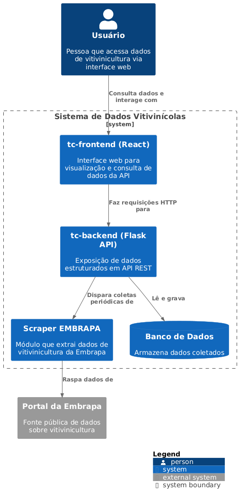

# 🍇 Embrapa Vitivinicultura API - Tech Challenge

Projeto desenvolvido como parte do **Tech Challenge** do curso de Machine Learning Engineering da Pos Tech. O objetivo é disponibilizar dados públicos da vitivinicultura brasileira, oriundos da Embrapa, por meio de uma API REST, visando futura aplicação em modelos de Machine Learning.

## 📦 Estrutura do Projeto (Monorepo)

Este repositório está organizado como um monorepo contendo duas aplicações principais:

- [`tc-backend`](./tc-backend): Aplicação em **Python** utilizando **Flask**, responsável por realizar web scraping do site da Embrapa e expor os dados em uma API REST (em desenvolvimento).
- [`tc-frontend`](./tc-frontend): Interface web para consulta e visualização dos dados da API (em desenvolvimento ou opcional).

---

## 🧠 Motivação

A vitivinicultura é uma atividade econômica importante em várias regiões do Brasil. A Embrapa disponibiliza dados valiosos sobre a produção, comercialização, importação e exportação de uvas e vinhos, mas esses dados estão disponíveis apenas em formato tabular na web.

Este projeto automatiza a extração e organização desses dados por meio de uma API RESTful para facilitar análises e alimentar modelos de aprendizado de máquina no futuro.

---

## 🚀 Funcionalidades

### Backend (tc-backend)

- 🔍 Scraping automatizado do site da Embrapa:
  - Produção
  - Processamento
  - Comercialização
  - Importação
  - Exportação
- 🔧 API RESTful com rotas documentadas
- 🔐 (Opcional) Autenticação via JWT
- 📄 Documentação da API via Swagger/OpenAPI

---

## 🔗 Link do site da Embrapa

Os dados são extraídos de:
[http://vitibrasil.cnpuv.embrapa.br/index.php?opcao=opt_01](http://vitibrasil.cnpuv.embrapa.br/index.php?opcao=opt_01)

---

## 🧭 Arquitetura (Modelo C4 - Contexto)



---

## 📁 Instalação e Execução

### Requisitos

- Python 3.10+
- Pip / virtualenv
- Node.js (para o frontend, se aplicável)

### Backend

```bash
cd tc-backend
python -m venv venv
source venv/bin/activate  # no Windows: venv\Scripts\activate
pip install -r requirements.txt
flask run
```
